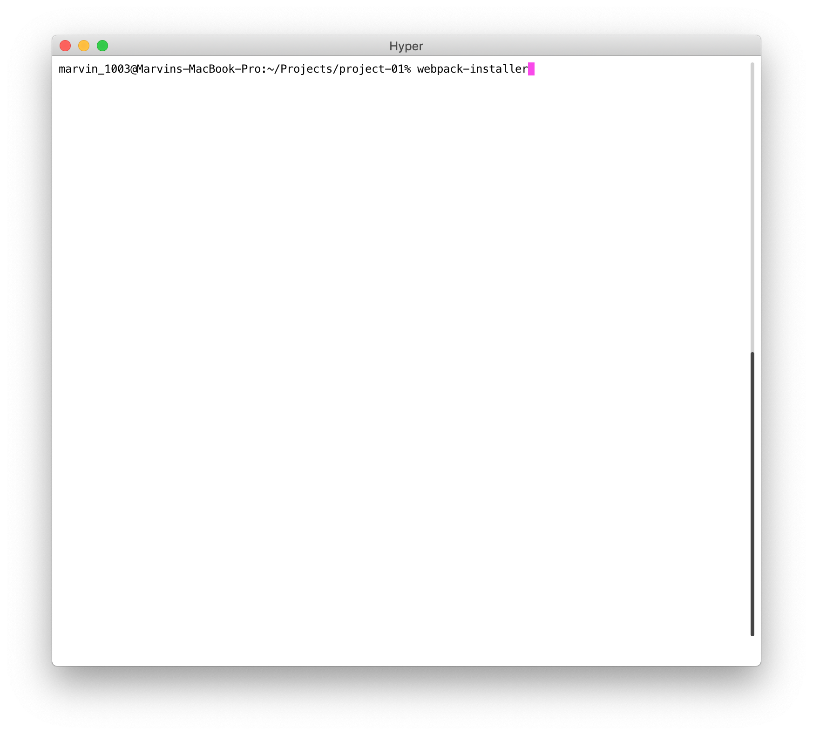
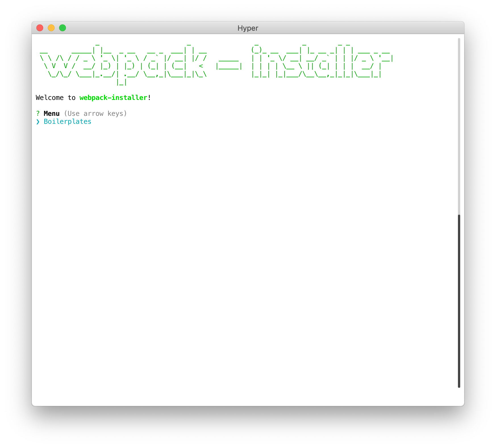
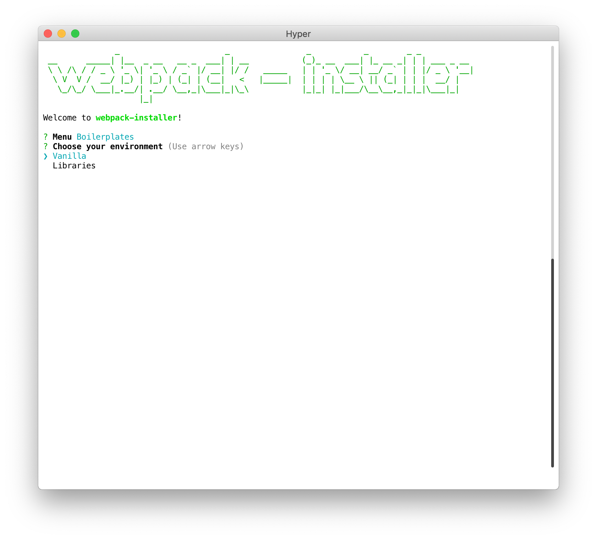
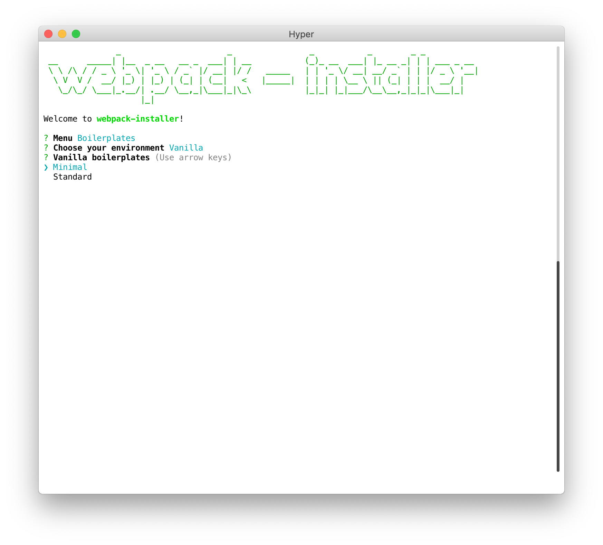
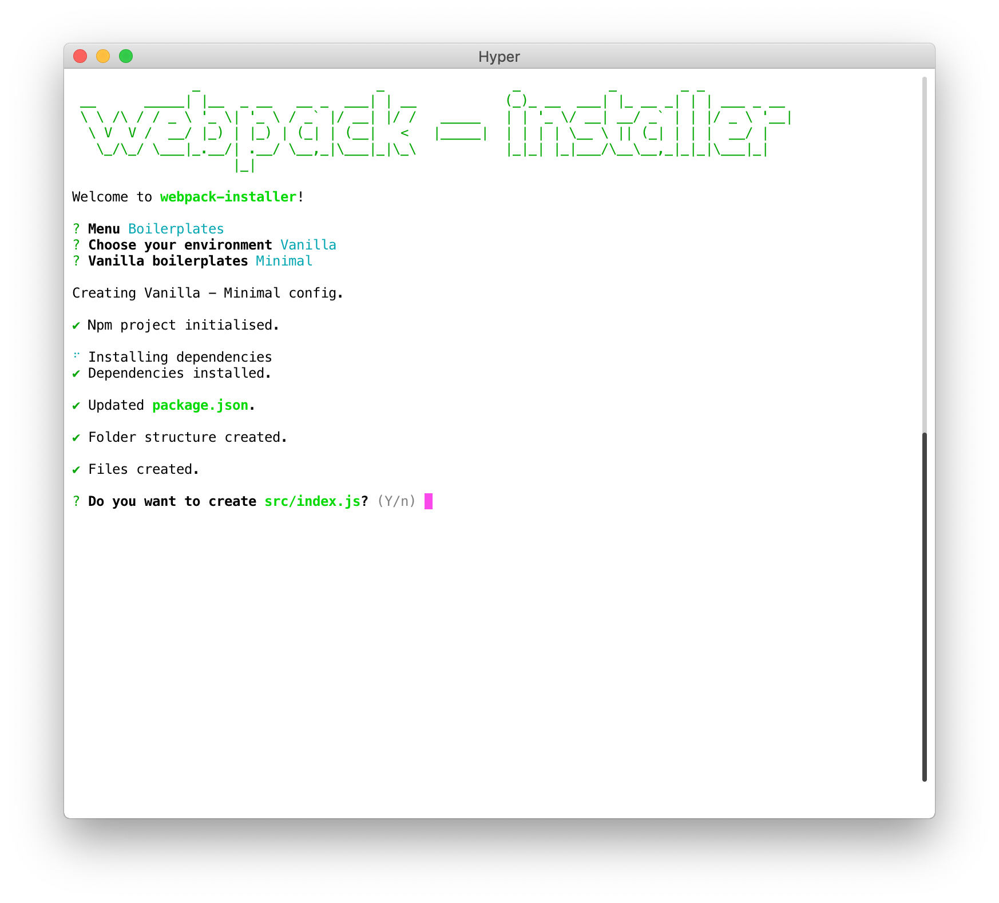
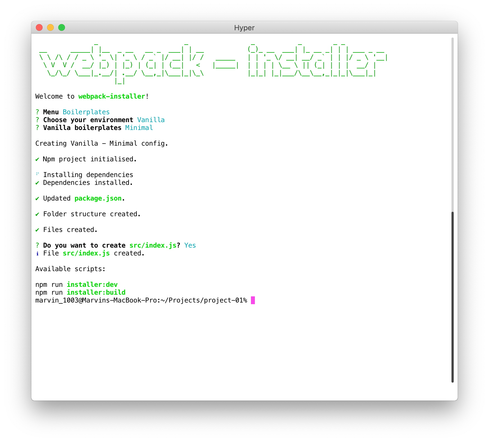
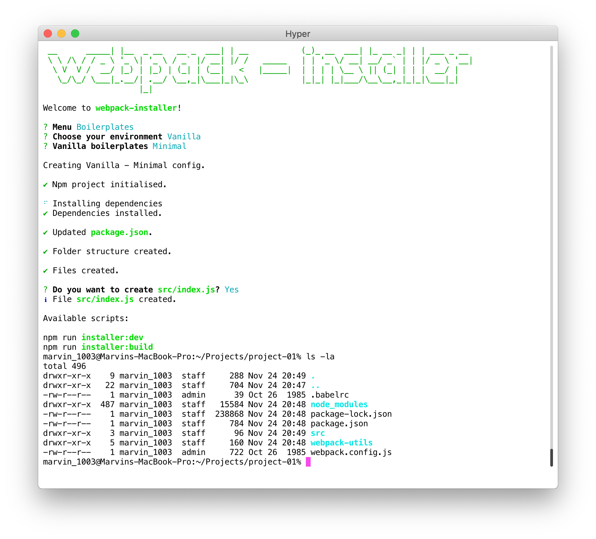
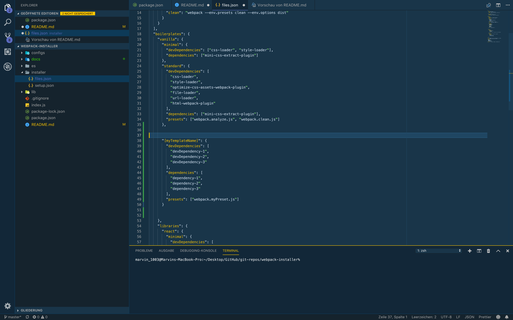
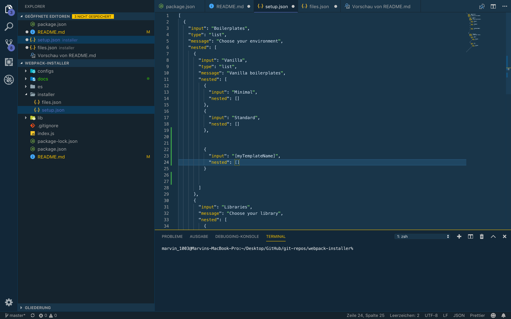
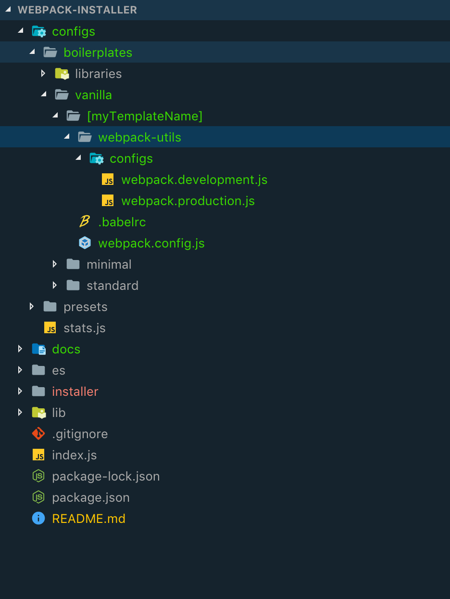

# webpack-installer

[![npm][npm]][npm-url]
[![dependencies][dependencies]][dependencies-url]
[![code style: prettier][prettier]][prettier-url]

**webpack-installer** lets you easily bootstrap a project with a webpack boilerplate of your choice.

## Installation

```bash
npm install -g webpack-installer
```

## Usage

Just type `webpack-installer` in the root directory of your project.
You can either start a fresh project with **webpack-installer** or update an existing one with a webpack boilerplate.

<div float="left">
  
  
  
  
  
  
  
</div>

## How can I add my boilerplate?

_First of all thank you for considering adding a boilerplate! Together we can create a huge collection of boilerplates for various of situations and setups._

### Step 1

Take a look at `data/files.json`. In this example we add a boilerplate to the vanilla boilerplates.
The structure of `files.json` represents the hierarchy of the installer menu, so add an object at the place where you want your boilerplate to be displayed in the installer. The key has to be the name of your boilerplate.
You can define the `devDependencies` and `dependencies` of your boilerplate here. Those will get automatically installed in the generation process of your boilerplate.



### Step 2

Then you have to take a look at `installer/setup.json`. This file is responsible for making your boilerplate visible to the CLI. Its the same as in the `files.json` file. The structure represents the hierarchy of the installer. You have to add an object at the right place with to keys: `input` and `nested`. In the `input` key you have to put the name of your boilerplate that you also used in the `files.json`. In the `nested` key you could create another subtree for boilerplates, but in this case we dont want that so just assign an empty array.



### Step 3

Your almost done! Now you only have to add your boilerplate files to `configs/boilerplates/`. Same as usual, include it at the right place, like in the `files.json` and `setup.json`.
In this case we want the boilerplate to be under `configs/boilerplates/vanilla/`. Keep in mind the folder name of your boilerplate has to be inline with names you provided in the other configuration files.



Thanks to the [@TheLarkInn](https://twitter.com/thelarkinn) for inspiring and motivating me to this project with his awesome webpack courses.

[npm]: https://img.shields.io/npm/v/webpack-installer.svg?style=flat-square
[npm-url]: https://npmjs.com/package/webpack-installer
[dependencies]: https://img.shields.io/david/Marvin1003/webpack-installer.svg?style=flat-square
[dependencies-url]: https://david-dm.org/Marvin1003/webpack-installer
[prettier]: https://img.shields.io/badge/code_style-prettier-ff69b4.svg?style=flat-square
[prettier-url]: https://github.com/prettier/prettier
